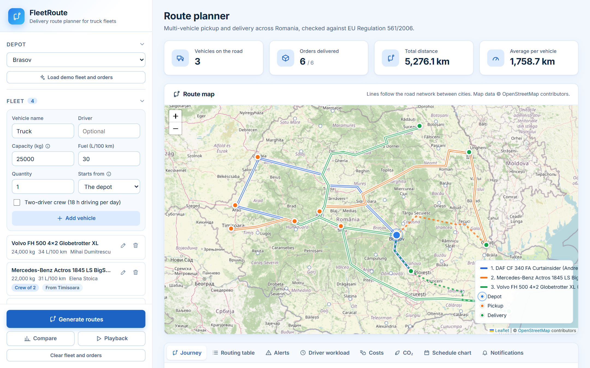
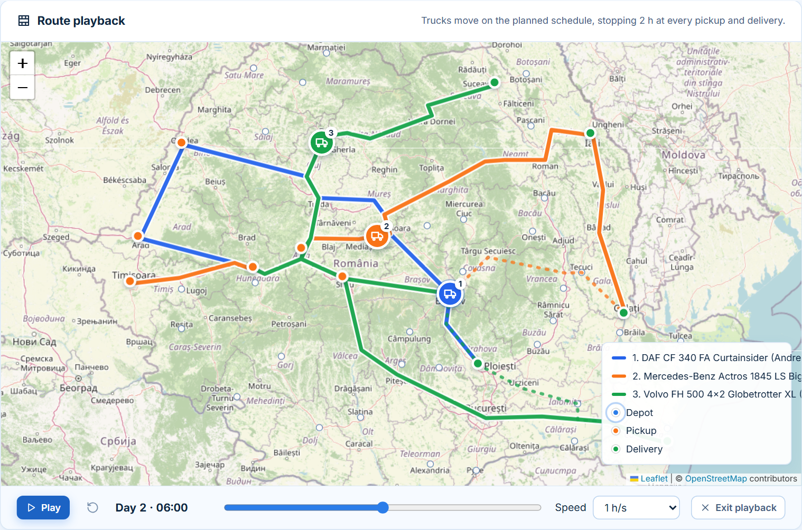
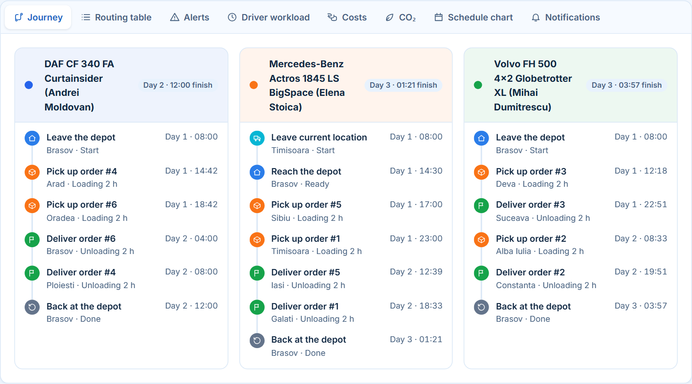
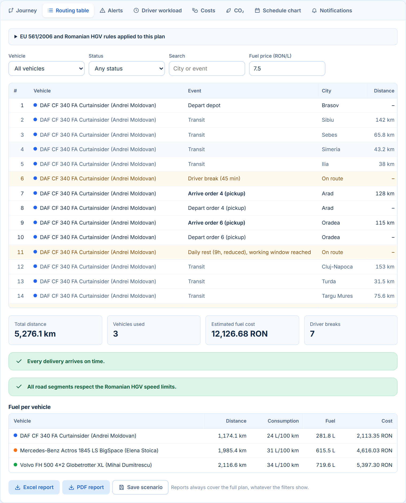
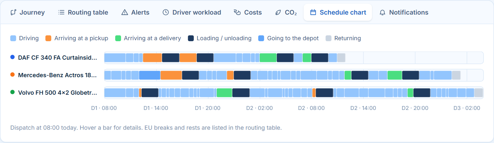
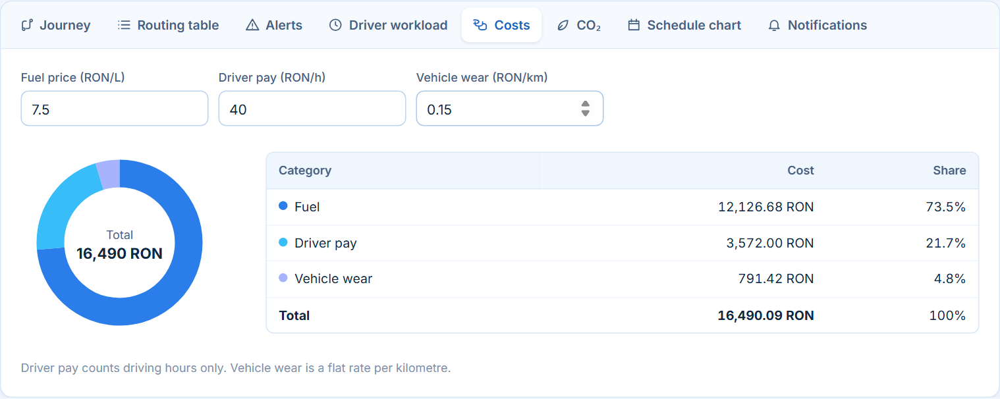
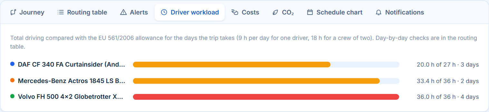
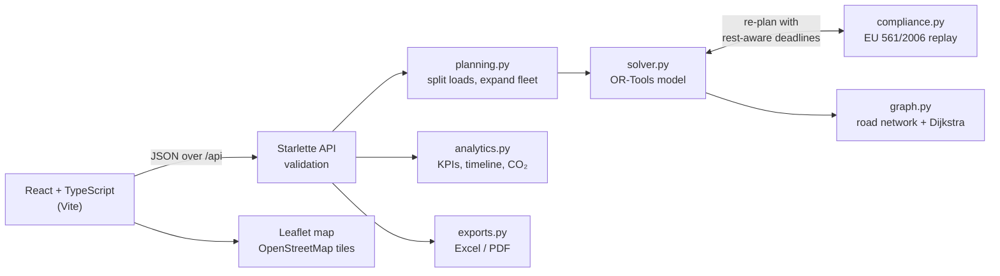

# FleetRoute

[](https://github.com/CataBulu/FleetRoute/actions/workflows/ci.yml)
[](LICENSE)

**A delivery route planner for truck fleets.** You enter a depot, your trucks and a list of
pickup-and-delivery orders. FleetRoute decides which truck carries which load, in what
order, and when. Every plan respects truck capacity, delivery deadlines and the EU rules on
driving and rest time.

The optimisation uses Google OR-Tools behind a Python / Starlette API. The interface is
React + TypeScript with an interactive Leaflet map. The road network of 59 Romanian cities
ships with the project, so planning runs entirely offline. Only the map background comes
from OpenStreetMap.



## Highlights

- **Vehicle routing with real constraints.** Pickup-and-delivery pairs on the same truck,
  capacity per vehicle, delivery deadlines, earliest pickup times and priority orders.
  All of it is modelled with the OR-Tools routing solver, with a greedy fallback.
- **Plans that are legal to drive.** Every candidate plan is replayed against EU Regulation
  561/2006: 45-minute breaks, regular and reduced daily rests, weekly rests, the 56 h /
  90 h limits, and two-driver crews. When rests would make a delivery late, the optimiser
  re-plans with rest-aware deadlines. So deadlines hold on the legal schedule, not just
  on paper.
- **Three planning goals.** Shortest distance, shortest driving time, or a weighted balance
  of both, plus a side-by-side comparison of four first-solution strategies.
- **Load splitting.** Orders heavier than the biggest truck are split across several
  vehicles.
- **Route playback.** Trucks move across the map on their planned schedule, stopping for
  loading and unloading.
- **Operational dashboards.** Journey timeline, Gantt-style schedule, driver workload,
  cost breakdown, CO₂ footprint, alerts, Romanian truck speed-limit checks and customer
  notifications.
- **Exports.** Excel and PDF reports, plus JSON import and export of fleets, orders and
  whole scenarios.

## Screenshots

| Route playback | Journey timeline |
|---|---|
|  |  |

| EU 561/2006 routing table | Schedule chart |
|---|---|
|  |  |

| Cost breakdown | Driver workload |
|---|---|
|  |  |

## Tech stack

| Layer | Technologies |
|-------|--------------|
| Frontend | React 19, TypeScript, Vite, Leaflet / react-leaflet, hand-written SVG charts |
| Backend | Python 3.11–3.13, Starlette, Uvicorn |
| Optimisation | Google OR-Tools (constraint solver), NetworkX (Dijkstra shortest paths) |
| Reports | xlsxwriter, fpdf2 |
| Quality | pytest (53 tests), TypeScript strict mode, oxlint, GitHub Actions CI |
| Delivery | Multi-stage Docker image, Render blueprint |

## Architecture



- The **solver** builds a pickup-and-delivery model: a capacity dimension, and a time
  dimension with loading time and waiting allowed. Deadlines and earliest-pickup windows
  are time-window constraints. Orders sit in drop penalties, weighted up for priority
  orders.
- The **compliance engine** walks each route segment by segment and inserts breaks and
  rests where the regulation requires them. The solver uses it inside a refinement loop.
  After each solve, every delivery's deadline in the model is scaled by how much rests
  stretched its route, and the best of up to six rounds is kept. An order that cannot be
  delivered legally in time is reported as undeliverable, not planned late.
- Solver calls run in a worker thread (`run_in_threadpool`), so the API stays responsive
  during longer optimisations.
- In production, Starlette serves the built frontend and the API from a single port.

## Getting started

Requirements: **Python 3.11–3.13** and **Node.js 20.19+**.

### Windows

| Script | What it does |
|--------|--------------|
| `dev.bat` | Starts the API (auto-reload) and the Vite dev server in two windows, then opens the app |
| `run.bat` | Builds the interface once and serves everything at http://localhost:8000 |

Both scripts create the Python environment and install the packages on first run.

### macOS / Linux

```bash
./dev.sh
```

### Docker

```bash
docker build -t fleetroute .
```

```bash
docker run -p 8000:8000 fleetroute
```

Then open http://localhost:8000.

### Manual setup

```bash
python -m venv .venv
```

```bash
.venv/bin/pip install -r backend/requirements-dev.txt
```

```bash
npm --prefix frontend install
```

Then run the API and the frontend in two terminals:

```bash
.venv/bin/python -m uvicorn fleetroute.app:app --app-dir backend --reload
```

```bash
npm --prefix frontend run dev
```

Open http://localhost:5173 and click **Try the demo data**, then **Generate routes**.

On Windows, use `.venv\Scripts\` instead of `.venv/bin/`.

## Deploying

The repository includes a `render.yaml` blueprint. In the [Render](https://render.com)
dashboard, choose **New → Blueprint**, pick this repository, and Render builds the Docker
image and serves the app with a health check on `/api/health`. The blueprint asks for the
free instance type; change `plan` in `render.yaml` if your account uses another.

Any other host that runs Docker images works the same way. The container listens on the
port given in the `PORT` environment variable (default 8000).

## Tests

```bash
.venv/bin/python -m pytest backend
```

```bash
npm --prefix frontend run typecheck
```

```bash
npm --prefix frontend run lint
```

The backend suite has 53 tests:
- solver behaviour on a small fixed network: deadlines, waiting for pickup windows,
  priorities, open routing, fallback
- EU-rule boundaries on the real road network, e.g. a delivery a single driver cannot
  make but a two-driver crew can
- the rules engine
- input handling and load splitting
- the HTTP API

GitHub Actions runs everything on every push:
- the backend suite on Python 3.11, 3.12 and 3.13
- the frontend type-check, lint and build
- a Docker build that starts the container and checks that the demo plan is fully
  on time

## API

| Method | Path | Purpose |
|--------|------|---------|
| GET | `/api/cities` | Selectable cities with coordinates |
| GET | `/api/demo` | Sample depot, fleet and orders |
| POST | `/api/plan` | Solve a plan. Returns routes, map lines, KPIs, schedule, timeline and alerts |
| POST | `/api/compare` | Solve with each first-solution strategy and compare the results |
| POST | `/api/export/{xlsx,pdf}` | Report for a set of planned routes |

<details>
<summary>Example plan request</summary>

```json
{
  "depot": "Brasov",
  "vehicles": [{ "name": "Truck 1", "driver": "Ana", "capacity_kg": 24000, "fuel_l100km": 30,
                 "crew": false, "count": 1, "home_city": null }],
  "orders": [{ "pickup": "Arad", "delivery": "Iasi", "demand_kg": 8000, "deadline_h": 48,
               "earliest_pickup_h": 0, "priority": false }],
  "mode": "economic",
  "return_to_depot": true,
  "allow_split": false
}
```

Times are hours after dispatch (08:00 on the planning day). Invalid input returns
`400` with a readable `error` message.
</details>

## Project structure

```
backend/
  fleetroute/
    app.py          Starlette routes and input validation
    solver.py       OR-Tools model, rest-aware refinement, strategy comparison
    planning.py     Input normalisation, load splitting, fleet expansion
    compliance.py   EU 561/2006 and Romanian HGV rules
    analytics.py    KPIs, workload, CO2, alerts, timeline
    exports.py      Excel and PDF reports
    graph.py        Road network and shortest paths
    data/           City coordinates, road network, demo data
  tests/
frontend/
  src/
    App.tsx         Planner state and layout
    components/     Sidebar forms, map and playback, result tabs
    api.ts          Typed API client
    types.ts        Types matching the API responses
.github/workflows/  CI pipeline
docs/screenshots/
Dockerfile          Multi-stage build: Vite bundle + Python API
render.yaml         Render deployment blueprint
dev.bat, dev.sh     Start backend and frontend for development
run.bat             Build once and serve on one port
```

## Modelling assumptions

- Distances and driving times come from the bundled road graph (shortest path by
  distance). Map lines connect the cities along that path rather than the exact road
  geometry.
- Every pickup and delivery takes 2 hours of loading or unloading.
- Rest-aware planning is a heuristic. When the fleet is too tight to do everything legally
  on time, the routing table still flags any delivery that ends up late.
- Weekend and holiday driving bans for trucks over 7.5 t are not modelled.

## License

Released under the [MIT License](LICENSE).

---

Built by [Catalin](https://github.com/CataBulu). Map data ©
[OpenStreetMap](https://www.openstreetmap.org/copyright) contributors.
