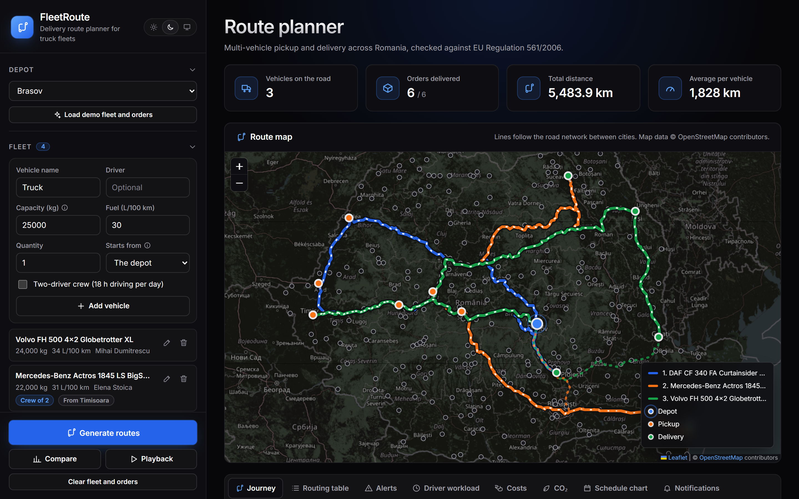
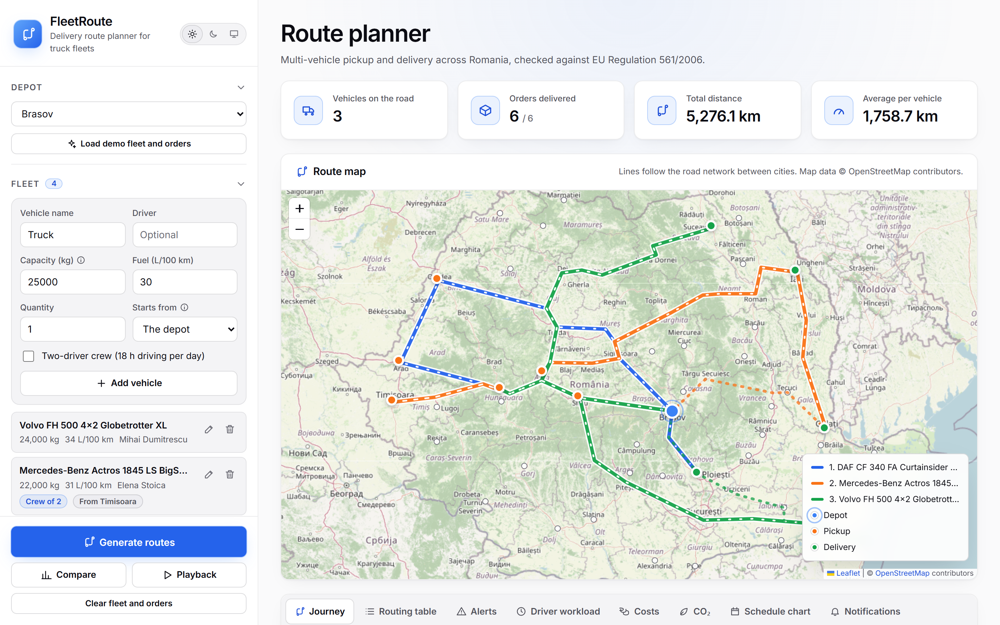
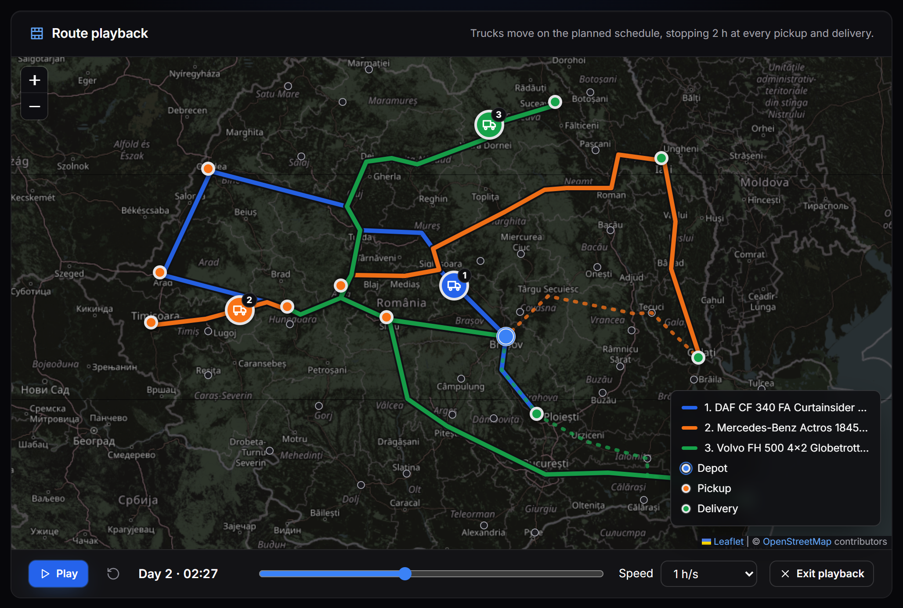
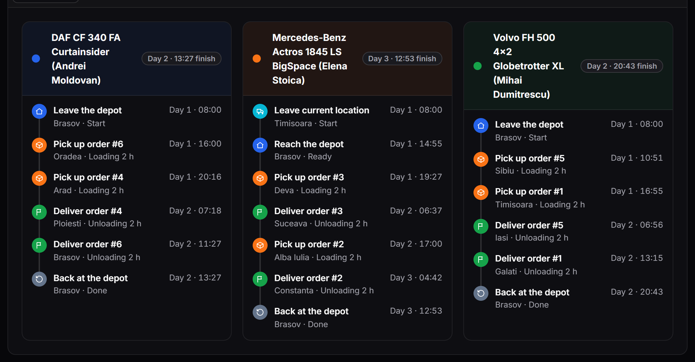
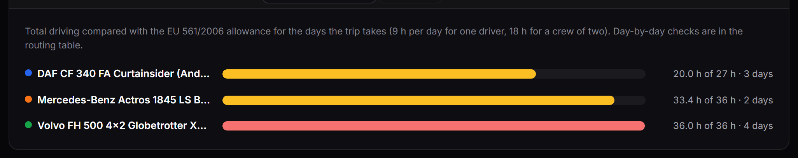
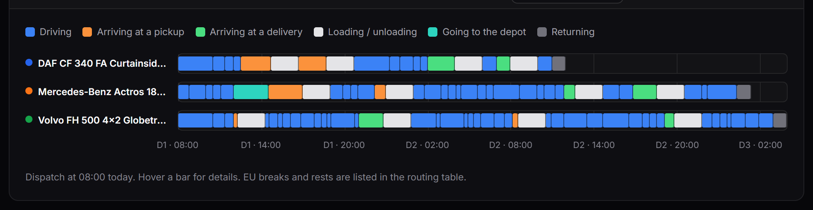
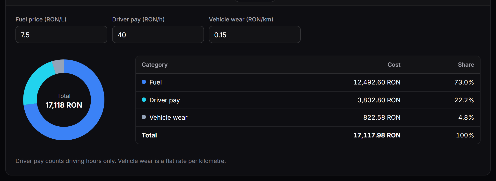
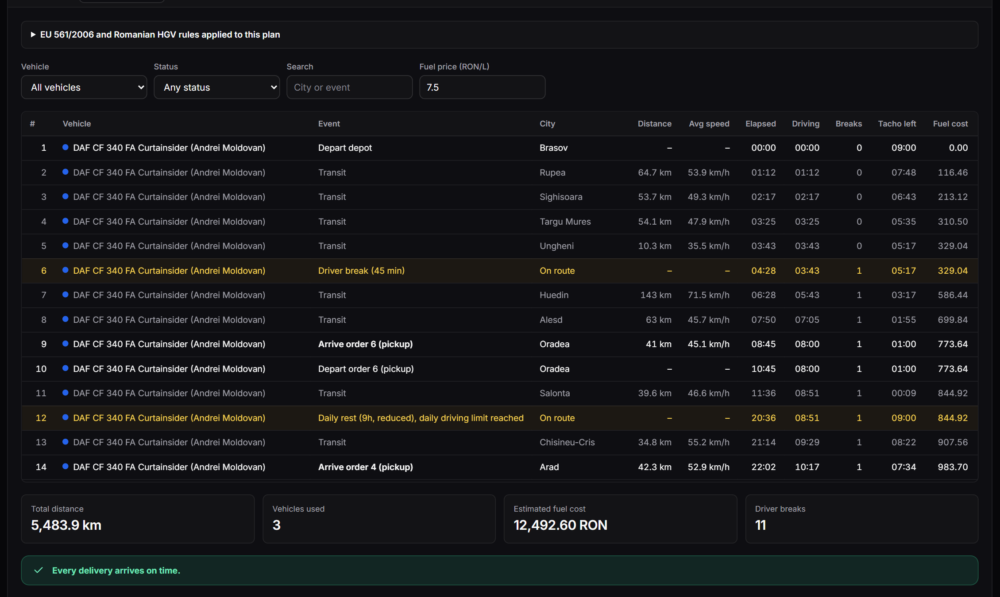
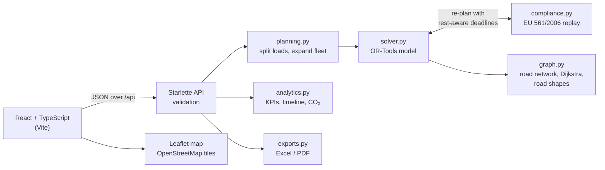

#  FleetRoute

[](https://github.com/CataBulu/FleetRoute/actions/workflows/ci.yml)
[](https://github.com/CataBulu/FleetRoute/actions/workflows/github-code-scanning/codeql)
[](https://www.python.org/)
[](https://www.starlette.io/)
[](https://developers.google.com/optimization/routing)
[](https://networkx.org/)
[](https://react.dev/)
[](https://www.typescriptlang.org/)
[](#tests)
[](https://vite.dev/)
[](https://leafletjs.com/)
[](Dockerfile)
[](#highlights)
[](https://eur-lex.europa.eu/eli/reg/2006/561/oj)
[](LICENSE)

**A delivery route planner for truck fleets.** You enter a depot, your trucks and a list of
pickup-and-delivery orders. FleetRoute decides which truck carries which load, in what
order, and when. Every plan respects truck capacity, delivery deadlines and the EU rules on
driving and rest time.

The optimisation uses Google OR-Tools behind a Python / Starlette API. The interface is
React + TypeScript with an interactive Leaflet map, in dark and light themes. A road
network covering every city and town in Romania ships with the project, with real road
distances, truck driving times and road shapes, so planning runs entirely offline. Only the
map background is loaded from OpenStreetMap.



## Highlights

- **The whole of Romania.** All 318 cities and towns reachable by road, from Bucharest to
  the smallest town, linked by the real roads between them. Any of them can be a depot,
  a pickup or a delivery.
- **Vehicle routing with real constraints.** Pickup-and-delivery pairs on the same truck,
  capacity per vehicle, delivery deadlines, earliest pickup times and priority orders.
  All of it is modelled with the OR-Tools routing solver, with a greedy fallback.
- **Plans that are legal to drive.** Every candidate plan is replayed against EU Regulation
  561/2006: 45-minute breaks, regular and reduced daily rests, weekly rests, the 56 h /
  90 h limits, and two-driver crews. When rests would make a delivery late, the optimiser
  re-plans with rest-aware deadlines. So deadlines hold on the legal schedule, not just
  on paper.
- **Three planning goals.** Shortest distance, shortest driving time, or a weighted balance
  of both, plus a side-by-side comparison of four first-solution strategies.
- **Load splitting.** Orders heavier than the biggest truck are split across several
  vehicles.
- **Route playback.** Trucks drive along the real roads on the map, on their planned
  schedule, stopping for loading and unloading.
- **Operational dashboards.** Journey timeline, Gantt-style schedule, driver workload,
  cost breakdown, CO₂ footprint, alerts, Romanian truck speed-limit checks and customer
  notifications.
- **Exports.** Excel and PDF reports, plus JSON import and export of fleets, orders and
  whole scenarios.
- **Dark, light and auto themes.** A dark interface with a blue accent and a light
  counterpart. Auto follows the operating system as it changes, the choice is remembered,
  and a reload never flashes the wrong theme. Every colour, including the map lines and
  charts, comes from CSS design tokens, and text meets WCAG AA contrast in both themes.

## Screenshots

| Light theme | Route playback |
|---|---|
|  |  |

| Journey timeline | Driver workload |
|---|---|
|  |  |

| Schedule chart | Cost breakdown |
|---|---|
|  |  |

**EU 561/2006 routing table**, with breaks and rests inserted where the regulation requires them:



## Tech stack

| Layer | Technologies |
|-------|--------------|
| Frontend | React 19, TypeScript, Vite, Leaflet / react-leaflet, hand-written SVG charts, CSS design tokens (dark and light themes) |
| Backend | Python 3.11–3.13, Starlette, Uvicorn |
| Optimisation | Google OR-Tools (constraint solver), NetworkX (Dijkstra shortest paths) |
| Road data | OpenStreetMap via OSRM (distances, times, road shapes), Wikidata (towns), built once by a script |
| Reports | xlsxwriter, fpdf2 |
| Quality | pytest (73 tests + data checks on all 1,704 road links), Vitest (42 tests), TypeScript strict mode, oxlint, GitHub Actions CI, CodeQL |
| Delivery | Multi-stage Docker image, Render blueprint |

## Architecture


```mermaid
flowchart LR
    UI["React + TypeScript<br/>(Vite)"] -- "JSON over /api" --> API["Starlette API<br/>validation"]
    API --> PLAN["planning.py<br/>split loads, expand fleet"]
    PLAN --> SOLVER["solver.py<br/>OR-Tools model"]
    SOLVER <-->|"re-plan with<br/>rest-aware deadlines"| RULES["compliance.py<br/>EU 561/2006 replay"]
    SOLVER --> GRAPH["graph.py<br/>road network, Dijkstra,<br/>road shapes"]
    API --> ANALYTICS["analytics.py<br/>KPIs, timeline, CO₂"]
    API --> EXPORTS["exports.py<br/>Excel / PDF"]
    UI --> MAP["Leaflet map<br/>OpenStreetMap tiles"]
```

- The **solver** builds a pickup-and-delivery model: a capacity dimension, and a time
  dimension with loading time and waiting allowed. Deadlines and earliest-pickup windows
  are time-window constraints. Orders sit in drop penalties, weighted up for priority
  orders.
- The **compliance engine** walks each route segment by segment and inserts breaks and
  rests where the regulation requires them. The solver uses it inside a refinement loop.
  After each solve, every delivery's deadline in the model is scaled by how much rests
  stretched its route, and the best of up to six rounds is kept. An order that cannot be
  delivered legally in time is reported as undeliverable, not planned late.
- Solver calls run in a worker thread (`run_in_threadpool`), so the API stays responsive
  during longer optimisations.
- In production, Starlette serves the built frontend and the API from a single port.

## Getting started

Requirements: **Python 3.11–3.13** and **Node.js 20.19+**.

### Windows

| Script | What it does |
|--------|--------------|
| `dev.bat` | Starts the API (auto-reload) and the Vite dev server in two windows, then opens the app |
| `run.bat` | Builds the interface once and serves everything at http://localhost:8000 |

Both scripts create the Python environment and install the packages on first run.

### macOS / Linux

```bash
./dev.sh
```

### Docker

```bash
docker build -t fleetroute .
```

```bash
docker run -p 8000:8000 fleetroute
```

Then open http://localhost:8000.

### Manual setup

```bash
python -m venv .venv
```

```bash
.venv/bin/pip install -r backend/requirements-dev.txt
```

```bash
npm --prefix frontend install
```

Then run the API and the frontend in two terminals:

```bash
.venv/bin/python -m uvicorn fleetroute.app:app --app-dir backend --reload
```

```bash
npm --prefix frontend run dev
```

Open http://localhost:5173 and click **Try the demo data**, then **Generate routes**.

On Windows, use `.venv\Scripts\` instead of `.venv/bin/`.

## Deploying

The repository includes a `render.yaml` blueprint. In the [Render](https://render.com)
dashboard, choose **New → Blueprint**, pick this repository, and Render builds the Docker
image and serves the app with a health check on `/api/health`. The blueprint asks for the
free instance type; change `plan` in `render.yaml` if your account uses another.

Any other host that runs Docker images works the same way. The container listens on the
port given in the `PORT` environment variable (default 8000).

## Tests

```bash
.venv/bin/python -m pytest backend
```

```bash
npm --prefix frontend run typecheck
```

```bash
npm --prefix frontend run lint
```

```bash
npm --prefix frontend test
```

The backend suite has 73 tests, plus two data checks on each of the 1,704 road links
(3,481 in all):
- solver behaviour on a small fixed network: deadlines, waiting for pickup windows,
  priorities, open routing, fallback
- EU-rule boundaries on the real road network, e.g. a delivery a single driver cannot
  make but a two-driver crew can
- the rules engine, including a segment longer than the break window (it used to loop
  forever)
- input handling and load splitting
- the HTTP API
- the road network: all 318 towns connected, the original city names kept, every link's
  truck time plausible and inside the EU break window, and every road shape running from
  town to town with a length close to the one the planner uses
- the network builder's offline parts: town names, shape encoding and simplification,
  truck times, and how links and shortcuts are chosen

The frontend suite (Vitest) has 42 tests:
- time and number formatting, and importing fleets and orders saved by the original version
- truck positions during route playback, along the road shapes and through the 2 h loading stops
- the API client's error messages
- the theme rules, including a check that the no-flash script in `index.html` agrees with them

GitHub Actions runs everything on every push and pull request:
- the backend suite on Python 3.11, 3.12 and 3.13
- the frontend type-check, lint, unit tests and build
- a Docker build that starts the container and checks that the demo plan is fully on
  time, that all 318 towns are served, that a trip between small towns at opposite ends
  of the country follows real roads, and that responses are compressed

Every job has a time limit, and a newer push cancels the run it replaces. CodeQL scans
the Python, TypeScript and workflow code for security issues.

## API

| Method | Path | Purpose |
|--------|------|---------|
| GET | `/api/cities` | Selectable cities with coordinates |
| GET | `/api/demo` | Sample depot, fleet and orders |
| POST | `/api/plan` | Solve a plan. Returns routes (each step with its road shape), map lines, KPIs, schedule, timeline and alerts |
| POST | `/api/compare` | Solve with each first-solution strategy and compare the results |
| POST | `/api/export/{xlsx,pdf}` | Report for a set of planned routes |

<details>
<summary>Example plan request</summary>

```json
{
  "depot": "Brasov",
  "vehicles": [{ "name": "Truck 1", "driver": "Ana", "capacity_kg": 24000, "fuel_l100km": 30,
                 "crew": false, "count": 1, "home_city": null }],
  "orders": [{ "pickup": "Arad", "delivery": "Iasi", "demand_kg": 8000, "deadline_h": 48,
               "earliest_pickup_h": 0, "priority": false }],
  "mode": "economic",
  "return_to_depot": true,
  "allow_split": false
}
```

Times are hours after dispatch (08:00 on the planning day). Invalid input returns
`400` with a readable `error` message.
</details>

## Project structure

```
backend/
  fleetroute/
    app.py          Starlette routes and input validation
    solver.py       OR-Tools model, rest-aware refinement, strategy comparison
    planning.py     Input normalisation, load splitting, fleet expansion
    compliance.py   EU 561/2006 and Romanian HGV rules
    analytics.py    KPIs, workload, CO2, alerts, timeline
    exports.py      Excel and PDF reports
    graph.py        Road network and shortest paths
    data/           Towns, road network and road shapes, demo data
  tests/
frontend/
  src/
    App.tsx         Planner state and layout
    components/     Sidebar forms, map and playback, result tabs, theme switch
    styles.css      Design tokens for both themes, then the styles that use them
    theme.ts        Light / dark / auto: applies the saved choice and follows the OS
    api.ts          Typed API client
    types.ts        Types matching the API responses
.github/workflows/  CI pipeline
docs/screenshots/
Dockerfile          Multi-stage build: Vite bundle + Python API
render.yaml         Render deployment blueprint
dev.bat, dev.sh     Start backend and frontend for development
run.bat             Build once and serve on one port
scripts/            Setup helper; build_road_network.py rebuilds the road network
```

## Modelling assumptions

- The road network was built once by `scripts/build_road_network.py` and ships in
  `backend/fleetroute/data/`. The towns are Romania's 103 municipalities and 216 towns
  from [Wikidata](https://www.wikidata.org/), except Sulina, which has no road to the rest
  of the country. Each town is linked to its nearest towns, and
  [OSRM](https://project-osrm.org/) gives every link's road distance, driving time and
  shape (simplified to within 20 m). Direct links are added wherever a trip through the
  nearby towns would be over 5% longer or 10% slower than the real road, so 95% of all
  town-to-town trips are within 3% of the real road distance.
- Truck driving times are OSRM's car times plus 10%, and never faster than an 80 km/h
  average on any link (Romanian limits for trucks are 90 km/h on motorways and 70 km/h
  on national roads).
- Trucks take the fastest route through the network. Its time, its distance and the towns
  it passes all come from that one route, and the lines on the map and the trucks in
  playback follow its real roads.
- Every pickup and delivery takes 2 hours of loading or unloading.
- Rest-aware planning is a heuristic. When the fleet is too tight to do everything legally
  on time, the routing table still flags any delivery that ends up late.
- Weekend and holiday driving bans for trucks over 7.5 t are not modelled.

## License

The code is released under the [MIT License](LICENSE).

The road network in `backend/fleetroute/data/` (`roads.json` and `road_geometry.json`) is
derived from OpenStreetMap data, © OpenStreetMap contributors, and is available under the
[Open Database License](https://opendatacommons.org/licenses/odbl/1-0/). Town names and
positions come from Wikidata (CC0).

---

Built by [Catalin](https://github.com/CataBulu). Map data ©
[OpenStreetMap](https://www.openstreetmap.org/copyright) contributors.
